# How to create skin for Desktop Niko

To create a skin, you will need any image editor, any text editor,
and the ability to draw ;3

Your skin will be a folder with images supported by Godot (see [Supported image formats](https://docs.godotengine.org/en/4.6/tutorials/assets_pipeline/importing_images.html#supported-image-formats)) and a configuration file (.cfg) for the skin, which should be located in `%APPDATA%\DesktopNiko\Skins` on Windows or in `~/.local/share/DesktopNiko/Skins` on Linux

## Sprites

Default sprites use a 60x60 resolution for each sprite with 2x scaling in skin configuration, I recommend using the same resolution for each sprite

### Required sprites

Niko in Desktop Niko has 17 states (v5):
*<span style="opacity: 0.6; font-size: 0.9em;">name corresponds to file name</span>*

1. default
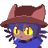

2. normal


3. speak
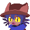

4. shock


5. surprised
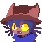

6. cool
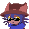
    <span style="opacity: 0.6; font-size: 0.9em;">Used in tennis when you lose</span>

7. sad
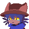
    <span style="opacity: 0.6; font-size: 0.9em;">Used when you hover over the shutdown shortcut</span>

8. cry
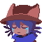
    <span style="opacity: 0.6; font-size: 0.9em;">Used when you double click on the shutdown shortcut</span>

9. super_cry
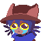
    <span style="opacity: 0.6; font-size: 0.9em;">Used if you clicked no in the "Alert: Pancake!" event</span>

10. eat1

    <span style="opacity: 0.6; font-size: 0.9em;">Used if you clicked yes in "Alert: Pancake!" event (frame 1)</span>

11. eat2

    <span style="opacity: 0.6; font-size: 0.9em;">Used if you clicked yes in "Alert: Pancake!" event (frame 2)</span>

12. look_left
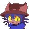
    <span style="opacity: 0.6; font-size: 0.9em;">Used in an animation that plays when you are idle for 3 minutes</span>

13. look_right

    <span style="opacity: 0.6; font-size: 0.9em;">Used in an animation that plays when you are idle for 3 minutes</span>

14. huh

    <span style="opacity: 0.6; font-size: 0.9em;">Used in "Pancake Machine" event</span>

15. pancakes
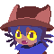
    <span style="opacity: 0.6; font-size: 0.9em;">Used in "Pancake Machine" and "Alert: Pancake!" events</span>

16. sleep
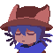
    <span style="opacity: 0.6; font-size: 0.9em;">Used if you don't click on Niko for a long time (default is 15 minutes)</span>

17. sleepy
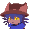
    <span style="opacity: 0.6; font-size: 0.9em;">Used if you don't click on Niko for a long time (default is 15 minutes)</span>

Technically, it's enough to make one `default.png` image, later assigning
it to all sprites, but I recommend doing all 17

### Extra Sprites

You can make any number of additional sprites, they will be added to facepics settings as extra sprites

1. smug

    <span style="opacity: 0.6; font-size: 0.9em;">Extra sprite</span>

2. smile
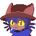
    <span style="opacity: 0.6; font-size: 0.9em;">Extra sprite</span>

## Skin configuration

The skin configuration consists of several sections: `[Info]`, `[Data]`, `[Sprites]`, and optional `[ExtraSprites]`

Here are parameters of these sections:

### \[Info]

Data displayed in DN

- **Name** `string`
  Any value
- **Description** `string`
  Any value
- **Author** `string`
  Any value
- **Version** `string`
  Version of skin, any value
- **Comment** `string`
  Any value
- **Tags** `string[]`
  List of tags, reserved for future versions, any value

### \[Data]

- **Format** `int`
  Format of skin, in v5 value is `5`
- **Scale** `float`
  Base scale of sprites

### \[Sprites]

Required sprites for skin
For values you can use Godot [Notations](https://docs.godotengine.org/en/4.6/tutorials/io/data_paths.html#file-paths-in-godot-projects) (`res://` and `user://`) and `skin://` notation reletive to skin folder

- **default** `string`
- **normal** `string`
- **speak** `string`
- **shock** `string`
- **surprised** `string`
- **cool** `string`
- **sad** `string`
- **cry** `string`
- **super_cry** `string`
- **eat1** `string`
- **eat2** `string`
- **look_left** `string`
- **look_right** `string`
- **huh** `string`
- **pancakes** `string`
- **sleep** `string`
- **sleepy** `string`

### \[ExtraSprites]

Optional, key for each entry is display text in DN

---

### Configuration example

skin.cfg from default skin, you can use it as template

```ini
[Info]

Name="Niko!"
Description="Messiah"
Author="Extended sprites by Issac332"
Version="2.0"
Comment="The original sprite is taken from OneShot(Obviously)"
Tags=["Niko", "OneShot"]

[Data]

Format=5
Scale=2.0

[Sprites]

default="skin://default.png"
normal="skin://normal.png"
speak="skin://speak.png"
shock="skin://shock.png"
surprised="skin://surprised.png"
cool="skin://cool.png"
sad="skin://sad.png"
cry="skin://cry.png"
super_cry="skin://super_cry.png"
eat1="skin://eat1.png"
eat2="skin://eat2.png"
look_left="skin://look_left.png"
look_right="skin://look_right.png"
huh="skin://huh.png"
pancakes="skin://pancakes.png"
sleep="skin://sleep.png"
sleepy="skin://sleepy.png"

[ExtraSprites]

smile="skin://smile.png"
smug="skin://smug.png"

```

Сlickable area is automatically calculated based on transparency channel of sprite

---

In result your skin folder can be look like that:

 your_skin<br>
├  cool.png<br>
├  cry.png<br>
├  default.png<br>
│ ...<br>
├  skin.cfg<br>
│ ...<br>
├  speak.png<br>
├  super_cry.png<br>
└  surprised.png

Or you can group sprites into folder:

 your_skin<br>
├  sprites<br>
│&nbsp;&nbsp;├  cool.png<br>
│&nbsp;&nbsp;├  cry.png<br>
│&nbsp;&nbsp;├  default.png<br>
│&nbsp;&nbsp;│&nbsp;&nbsp;&nbsp;...<br>
│&nbsp;&nbsp;├  speak.png<br>
│&nbsp;&nbsp;├  super_cry.png<br>
│&nbsp;&nbsp;└  surprised.png<br>
└  skin.cfg

but you need to specify the path to sprites along with the folder in skin.cfg

```ini
...
[Sprites]

default="skin://sprites/default.png"
normal="skin://sprites/normal.png"
...

[ExtraSprites]

smile="skin://sprites/smile.png"
smug="skin://sprites/smug.png"
...
```
